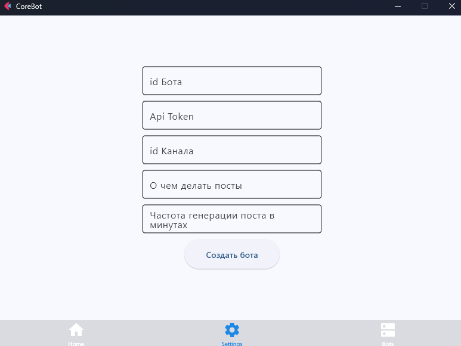
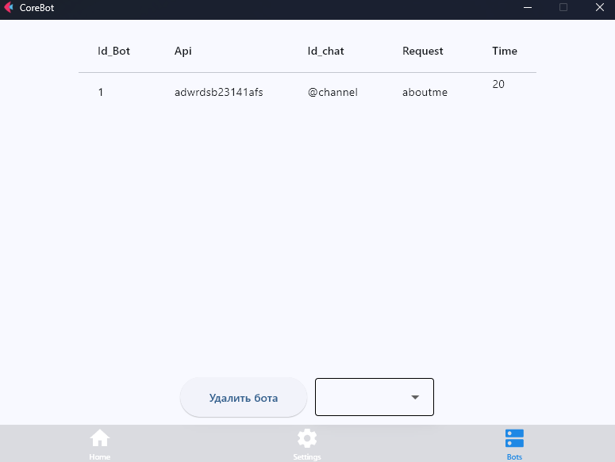
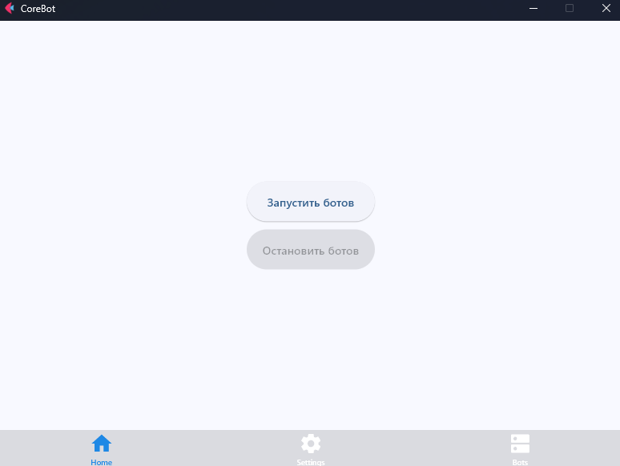

# Приложение для штамповки телеграм ботов

### Будут вести телеграм каналы на заданные темы

__Итак, бот основан на фреймворке flet__ \
__Каждый бот запускается в отдельном потоке__\
____
__How use??__
1. __Run app__
2. __Создайте бота задав ему:__
   1. id (1, 2, 3... уникальные значения), 
   2. api_token бота, 
   3. id канала (куда будет постить бот)
   4. О чем делать посты (Напиши интересный факт о ...) __вот тут важный момент, тема будт браться из бд которую высоздаете в самом боте или редактируя txt бота__\
   5. Время через которое бот снова выложит пост

3. __На вкладке Bots вы увидите созданных ботов, здесь же вы можете удалить ненужных__

4. Ну и наконец запустите ботов (тут же их можно остановить)

### __Ошибки, которые могут возникнуть придут в телеграм бота__